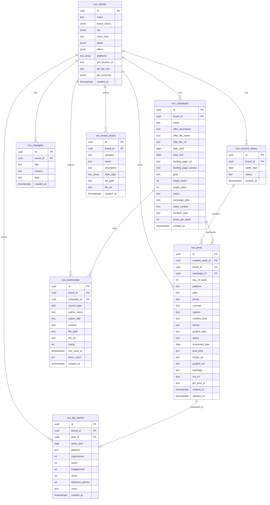

# Product Requirements Document — Social Content OS

**Project Name:** Social Content OS  
**Slug:** `sco`  
**Version:** 1.0  
**Date:** 2026-06-23  
**Status:** Active Development

---

## Build Readiness Checklist

Confirm these BEFORE starting any new phase. None of these change the product scope — they are environment facts that, if missed, cost time mid-build.

| # | Item | Default / Note | Filled in |
|---|------|---------------|-----------|
| 1 | Operating system of dev machine | Linux (Ubuntu 22.04) | ✓ |
| 2 | Node.js version installed | Node 20+ required | ✓ |
| 3 | Supabase Personal Access Token available? | Required for `supabase db push` from CLI | ☐ |
| 4 | Supabase CLI installed? | `supabase --version` should return | ✓ |
| 5 | Dev server port | Runs on port 3006 | ✓ |
| 6 | Git identity configured for this repo? | `git config user.email` + `user.name` set | ☐ |
| 7 | Tailwind version | v4 (installed; Rust binary confirmed working on this machine) | ✓ |
| 8 | OpenAI API key available? | Required for gpt-4o and DALL-E 3 | ✓ |
| 9 | Anthropic API key available? | SDK integrated; confirm if active use is planned | ☐ |
| 10 | GoHighLevel API key + Location ID? | Required before building GHL integration | ☐ |

---

## Clarifying Questions (Open)

1. **GoHighLevel API tier:** Which access level do you have — Location API (sub-account scoped) or Agency API (agency-level)? This determines whether GHL credentials are stored per brand or once globally.

2. **GoHighLevel account mapping:** Should the system fetch connected social accounts from GHL automatically via API, or will you manually configure platform → GHL account ID in brand settings?

3. **Testimonial multi-campaign tagging:** The current schema supports one `campaign_id` per testimonial. Should a testimonial be taggable to multiple campaigns? (Requires a junction table.)

4. **Authentication timeline:** Is auth a Phase 1 requirement (must ship before first deployment) or Phase 2 (acceptable to ship as single-user tool initially)?

5. **Testimonial graphic generation style:** When generating quote cards, should DALL-E use only `testimonial_template` assets as style references, or should it also consider general `style_reference` assets?

---

## Section 1: Executive Summary

**Architecture Type:** Dashboard / SaaS

**Justification:** The app is centered around viewing and managing data across multiple screens (brands, campaigns, calendar, assets, KPIs) with CRUD operations, visual organization, and scheduled content workflows. This is a classic dashboard/SaaS pattern.

**User Model:** Single-user (initially). Auth layer to be added in a future phase.

**What the app does:**

Social Content OS is an AI-powered content operating system for marketing teams and agencies managing social media for multiple client brands. It consolidates strategy planning, campaign management, post generation, scheduling, and performance tracking into a single workspace where AI has full brand context at every step.

Every AI generation — from strategic direction to individual post captions to visual assets — is informed by the brand's full profile: ICP, voice/tone, content pillars, offers, and visual style references.

**Success statement:**

A marketing manager can generate a complete month-long multi-platform campaign (40+ posts) in under 30 minutes, with every post on-brand and ready to schedule, without copy-pasting between documents, design tools, or scheduling platforms.

---

## Section 2: User Stories

### P0 — Must Have

**US-001: Create a brand**  
"As a user, I want to create a new brand profile with name, colors, ICP, voice/tone, pillars, offers, and active platforms, so that I can manage content for a specific client."  
- UI: `/brands/new` form with all brand property fields  
- Validation: name is required; platforms default to LinkedIn + Facebook  
- Success: brand saved to `sco_brands`; user redirected to `/brands/[id]`  
- Edge case: partial form state is client-only until submit (no partial saves)

**US-002: Select active brand**  
"As a user, I want to select which brand I'm working on from a header dropdown, so that all AI generations and content views are scoped to that brand."  
- Implementation: brand ID saved to `localStorage`; `brandChanged` custom event dispatched  
- All pages listen for `brandChanged` and re-fetch  
- Edge case: if no brands exist, show "Create your first brand" prompt

**US-003: Edit brand settings**  
"As a user, I want to edit any field in a brand's profile so that I can keep brand context current."  
- UI: `/brands/[id]` settings page  
- Success: updates saved to `sco_brands`; toast shown

**US-004: Generate content strategy via AI chat**  
"As a user, I want to describe strategic goals to an AI that has full brand context, so that I receive tailored strategic direction."  
- Implementation: POST `/api/chat` with `mode: 'strategy-generation'`; brand context injected into system prompt  
- Streams token-by-token; rendered as Markdown

**US-005: Save strategy to library**  
"As a user, I want to save an AI strategy as either 'Remaining' or 'Next Month' so that I can reference it later."  
- Success: saved to `sco_strategies`; each save creates a new versioned record

**US-006: Create a campaign**  
"As a user, I want to create a time-bound campaign with offer details, landing page URL, goals, and target metrics."  
- Required fields: name, start date, end date, posts per week  
- Optional: offer file upload, landing page URL, Google Drive URL, goal type, targets

**US-007: AI-generate campaign plan**  
"As a user, I want the AI to generate a structured WHY → HOW → WHAT content journey plan."  
- Implementation: POST `/api/chat` with `mode: 'campaign-plan'`  
- Plan saved to `sco_campaigns.campaign_plan`

**US-008: AI-generate campaign posts in bulk**  
"As a user, I want the AI to generate a full set of posts for the campaign duration, each with platform, pillar, phase, caption, creative brief, hashtags, CTA, and selected brand photo."  
- Count: `posts_per_week × campaign_duration_in_weeks`  
- Testimonials from library included in WHAT posts; campaign-tagged ones prioritised; 90-day cooldown respected  
- WHY posts: 150–250 words; HOW/WHAT posts: shorter

**US-009: Edit individual post**  
"As a user, I want to edit any generated post's caption, format, graphic type, creative brief, hashtags, or CTA before approving."  
- Edits saved to client state; not persisted to DB until batch approval

**US-010: Regenerate individual post**  
"As a user, I want to regenerate a single post while preserving its phase, platform, and pillar."  
- Implementation: POST `/api/chat` with `mode: 'regenerate-post'`

**US-011: Approve campaign posts and save to calendar**  
"As a user, I want to approve a batch of posts and save them to the calendar with scheduled dates."  
- Bulk insert into `sco_posts` with `status: 'drafted'`; `scheduled_date` set from campaign timeline  
- Campaign status updated to `posts_created`

**US-012: View calendar by week**  
"As a user, I want to see all scheduled posts in a multi-week calendar grid, colour-coded by platform."

**US-013: Edit post from calendar**  
"As a user, I want to click a post on the calendar and edit its caption, hashtags, CTA, media, creative brief, scheduled date, and status."  
- Status workflow: idea → drafted → designed → scheduled → posted (forward only)

**US-014: Upload brand photo to asset library**  
"As a user, I want to upload a photo and have AI automatically analyze and tag it."  
- AI generates description and `style_tags[]`

**US-015: Upload style reference to asset library**  
"As a user, I want to upload a style reference and have AI extract color palette, typography style, and layout patterns."

**US-016: Import testimonial via text entry**  
"As a user, I want to manually enter a testimonial's author, title, quote, and rating."

**US-017: Import testimonial via image upload (OCR)**  
"As a user, I want to upload a review screenshot and have AI extract the testimonial text, author, and rating."  
- AI detects sensitive info (phone, email) and returns bounding boxes; client blurs before saving

**US-018: Import testimonials via PDF batch upload**  
"As a user, I want to upload a PDF of reviews and have AI extract all testimonials in one pass."

**US-019: Tag testimonial to campaign**  
"As a user, I want to tag a testimonial to a campaign so that AI prioritizes it for WHAT-phase posts."

**US-020: Generate quote graphic from testimonial**  
"As a user, I want to generate a styled quote card using brand colors and testimonial templates."  
- Implementation: POST `/api/chat` with `mode: 'generate-testimonial-graphic'`; DALL-E 3

**US-021: Manually enter weekly KPIs**  
"As a user, I want to enter weekly performance metrics and optionally link them to a post."

---

### P1 — Should Have

**US-022: Delete brand** — Cascades to all child tables; clears `localStorage` if brand was active  
**US-023: View strategy history** — Reverse-chrono list with title, type badge, created date  
**US-024: Duplicate campaign** — Copy metadata with new name and dates; status reset to `draft`  
**US-025: Delete post from calendar** — Warn if post has `ghl_post_id` (scheduled in GHL)  
**US-026: Analyze Google Drive video context** — Transcript + summary saved to `sco_campaigns.video_context`  
**US-027: Modify generated graphic via text instruction** — POST `/api/chat` with `mode: 'modify-graphic'`  
**US-028: Filter calendar by platform** — Client-side filtering  
**US-029: Search testimonials by keyword** — Client-side filter on author_name and content  
**US-030: Week-to-week KPI comparison** — Delta indicators with up/down arrows

---

### P2 — Nice to Have

**US-031: Export campaign plan as PDF** — html2pdf.js converts campaign plan Markdown  
**US-032: Bulk edit post status** — Multi-select + batch status change  
**US-033: Auto-archive old posts** — Supabase cron; soft-delete posts > 90 days with status 'posted'  
**US-034: Clone testimonial graphic style** — Reuse style metadata from a previously generated graphic

---

## Section 3: Data Model

### Entity Relationship Diagram



---

### Entity Descriptions

**sco_brands**  
Central profile for each client brand. Stores all context injected into every AI generation.

Key business rules:
- `name` is required
- `platforms` defaults to `['linkedin', 'facebook']`
- `pillars`, `offers`, `icp`, `brand_colors` are JSONB with flexible schema
- `ghl_location_id`, `ghl_api_key`, `ghl_accounts` populated in GHL Phase 1

Column shapes:
- `brand_colors`: `{ primary?: string, accent?: string }`
- `icp`: `{ audience?: string, pain_points?: string, demographics?: string }`
- `pillars`: `Array<{ name: string, description: string }>`
- `offers`: `Array<{ name: string, description: string }>`
- `ghl_accounts`: `{ linkedin?: string, facebook?: string, instagram?: string, twitter?: string, tiktok?: string, youtube?: string }`

---

**sco_content_weeks**  
Groups posts into weekly batches. May be deprecated in favour of campaign-based scheduling.  
Status enum: `'draft' | 'pending_approval' | 'approved' | 'live'`

---

**sco_posts**  
Individual social media posts with all content, creative, scheduling, and workflow state.

Key business rules:
- `status` enum: `'idea' | 'drafted' | 'designed' | 'scheduled' | 'posted'` (forward-only in UI)
- `phase` enum: `'WHY' | 'HOW' | 'WHAT'`
- `format` enum: `'single_image' | 'carousel' | 'video'`
- `graphic_type` enum: `'photo_as_is' | 'photo_overlay' | 'ai_generated' | 'video'`
- `hashtags`: space-separated (e.g. `#marketing #AI #growth`)
- `ghl_post_id` populated after successful GHL scheduling (Phase 2)
- `campaign_id` FK links post back to its source campaign

---

**sco_strategies**  
Versioned strategic direction documents.  
Type enum: `'remaining' | 'next-month'`  
Multiple strategies of the same type can exist (each save is a new versioned record).

---

**sco_campaigns**  
Time-bound marketing campaigns with offer details, goals, and AI-generated plans.

Key business rules:
- `status` enum: `'draft' | 'plan_generated' | 'approved' | 'posts_created'`
- `duration_type` enum: `'monthly' | 'quarterly' | 'yearly'`
- `date_end` must be after `date_start`
- Total posts generated = `posts_per_week × duration_in_weeks`
- `landing_page_context` populated by AI after analysing `landing_page_url`
- `offer_file_url` stored in Supabase Storage after upload

---

**sco_kpi_weekly**  
Manual weekly performance data.

Key business rules:
- `week_start` should be a Monday
- If `post_id` is provided, it should reference a post from the same week (UI validation)
- `post_id` SET NULL on post delete

---

**sco_brand_assets**  
Brand photography, style references, and testimonial templates.

Key business rules:
- `category` enum: `'photo' | 'style_reference' | 'testimonial_template'`
- `file_path`: Supabase Storage path (e.g. `{brand_id}/photos/{filename}`)
- `description` and `style_tags` generated by AI on upload

---

**sco_testimonials**  
Customer testimonials with usage tracking, campaign tagging, and sensitive-info handling.

Key business rules:
- `source_type` enum: `'text' | 'image' | 'pdf'`
- `last_used_at` and `times_used` updated when testimonial is included in saved posts
- Testimonials used within 90 days are deprioritised (not excluded) in AI selection
- `campaign_id` FK: campaign-tagged testimonials prioritised for that campaign's WHAT posts
- `campaign_id` SET NULL on campaign delete

---

## Section 4: External Integrations & API Contracts

### OpenAI (gpt-4o + DALL-E 3)

| Field | Value |
|-------|-------|
| Base URL | `https://api.openai.com/v1/` |
| Auth | API Key (Bearer token) |
| Credential name | `OPENAI_API_KEY` |
| Storage | Server environment variable (never in client bundle) |
| Models | `gpt-4o` (chat + vision), `dall-e-3` (image generation) |
| Called from | `app/api/chat/route.ts` only |

**Chat Completions (strategy, plan generation):**
```json
{
  "model": "gpt-4o",
  "messages": [{ "role": "system", "content": "..." }, { "role": "user", "content": "..." }],
  "stream": true
}
```

**DALL-E 3 (graphic generation):**
```json
{
  "model": "dall-e-3",
  "prompt": "...",
  "size": "1024x1024",
  "quality": "standard",
  "n": 1
}
```

**Error handling:**
- 401 → "AI service authentication failed — check server config"
- 429 → Exponential backoff (2s, 4s, 8s), max 3 attempts; then return 429 to user
- 5xx → Log with timestamp; return 502 "AI service temporarily unavailable"
- Never expose raw OpenAI error messages to the client

---

### Anthropic Claude (SDK integrated, v1 minimal)

| Field | Value |
|-------|-------|
| Credential name | `ANTHROPIC_API_KEY` |
| Status | SDK installed (`@anthropic-ai/sdk ^0.105.0`); not actively used in v1 |
| Purpose | Available as fallback if OpenAI is unavailable |

---

### Supabase Storage (scos-brand-assets bucket)

| Field | Value |
|-------|-------|
| Bucket | `scos-brand-assets` (private; signed URLs) |
| Upload from | Client side direct to Supabase Storage (files > 1MB bypass API routes) |
| Path convention | `{brand_id}/{category}/{uuid}.{ext}` |

Folder structure:
```
scos-brand-assets/
└── {brand_id}/
    ├── photos/
    ├── style-refs/
    ├── testimonial-templates/
    └── testimonials/
```

**Error handling:**
- 413 → "File too large (max 5MB images, 10MB PDFs)"
- 400 → "Unsupported file type — only JPEG, PNG, PDF"
- 5xx → "Storage service unavailable — please try again"

---

### GoHighLevel Social Planner (Planned — Phase 2–3)

| Field | Value |
|-------|-------|
| Base URL | `https://services.leadconnectorhq.com/` |
| Auth | API Key (per-brand, stored in `sco_brands.ghl_api_key`) |
| Trigger (Phase 2) | Post status → "scheduled" |
| Trigger (Phase 3) | Manual "Sync from GHL" button on KPIs page |

**Phase 2 — Schedule post:**
```json
{
  "method": "POST",
  "path": "/social-media-posting/{locationId}/posts",
  "body": {
    "accountIds": ["acc_id"],
    "message": "[caption + hashtags]",
    "mediaUrls": ["media_url"],
    "scheduledDate": "ISO 8601"
  }
}
```

Success → save `postId` to `sco_posts.ghl_post_id`

**Phase 3 — Fetch analytics:**
```
GET /social-media-posting/{locationId}/posts/{postId}/analytics
→ { impressions, reach, clicks, engagement }
→ Upsert into sco_kpi_weekly matched by ghl_post_id
```

**Error handling:**
- 401 → Surface re-auth prompt in brand settings
- 429 → Retry with backoff; notify user
- 5xx → Do NOT mark post as "scheduled" locally; show retry button in calendar

---

## Section 5: Edge Function Specifications

All AI operations, file processing, and external API calls are handled by a single endpoint:  
**`POST /api/chat`** — mode-dispatched via the `mode` field in the request body.

### Mode Index

| Mode | Returns | Streaming |
|------|---------|-----------|
| `strategy-generation` | Text (strategy) | Yes |
| `strategy-save` | Saved strategy record | No |
| `campaign-plan` | Text (plan) | Yes |
| `campaign-posts` | JSON array of post objects | No |
| `regenerate-post` | Single post object | No |
| `generate-graphic` | Image URL | No |
| `modify-graphic` | Image URL | No |
| `extract-pdf` | Extracted text | No |
| `detect-sensitive-info` | Bounding box array | No |
| `extract-testimonials` | Testimonial array | No |
| `analyze-testimonial` | Testimonial object | No |
| `analyze-image` | Description text | No |
| `analyze-gdrive-image` | Description text | No |
| `analyze-gdrive-video` | Transcript + summary | No |
| `generate-testimonial-graphic` | Image URL | No |

**Rule: `stream: true` is ONLY used for `strategy-generation` and `campaign-plan` modes.** All other modes must use `stream: false` and return complete JSON. Streaming structured data (campaign posts) introduces parsing fragility with no UX benefit.

### Input Schema Highlights

**campaign-posts:**
```typescript
z.object({
  mode: z.literal("campaign-posts"),
  campaign: z.object({
    id: z.string().uuid(),
    name: z.string(),
    campaign_plan: z.string(),
    offer_description: z.string().optional(),
    duration_type: z.enum(["monthly", "quarterly", "yearly"]),
    posts_per_week: z.number(),
    date_start: z.string(),
    date_end: z.string(),
  }),
  brand: z.object({
    id: z.string().uuid(),
    name: z.string(),
    voice_tone: z.string().optional(),
    pillars: z.array(z.object({ name: z.string(), description: z.string() })),
    platforms: z.array(z.string()),
    brand_colors: z.object({ primary: z.string().optional(), accent: z.string().optional() }).optional(),
  }),
  assets: z.array(z.object({
    file_url: z.string(),
    description: z.string().optional(),
    style_tags: z.array(z.string()).optional(),
  })),
  testimonials: z.array(z.object({
    content: z.string(),
    author_name: z.string(),
    campaign_id: z.string().uuid().optional(),
    last_used_at: z.string().optional(),
  })),
})
```

**campaign-posts success response:**
```json
{
  "posts": [
    {
      "platform": "linkedin",
      "pillar": "Thought Leadership",
      "phase": "WHY",
      "format": "single_image",
      "graphic_type": "photo_overlay",
      "caption": "...",
      "creative_brief": "...",
      "hashtags": "#marketing #ai",
      "cta_url": "https://...",
      "scheduled_date": "2026-07-01",
      "overlay_headlines": ["Headline 1", "Headline 2", "Headline 3"],
      "selected_asset_url": "https://..."
    }
  ]
}
```

### Tables Touched by Mode

| Mode | Tables Read | Tables Written |
|------|-------------|----------------|
| strategy-generation | sco_brands | None |
| strategy-save | None | sco_strategies |
| campaign-plan | sco_campaigns, sco_brands | sco_campaigns (campaign_plan) |
| campaign-posts | sco_campaigns, sco_brands, sco_brand_assets, sco_testimonials | None (posts saved by frontend after approval) |
| regenerate-post | sco_posts, sco_brands, sco_brand_assets | None |
| generate-graphic | sco_posts, sco_brand_assets, sco_brands | sco_posts (graphic_url) |
| modify-graphic | sco_posts | sco_posts (graphic_url) |
| extract-pdf | None | None |
| detect-sensitive-info | None | None |
| extract-testimonials | None | None |
| analyze-testimonial | None | None |
| analyze-image | None | None |
| analyze-gdrive-image | None | None |
| analyze-gdrive-video | None | None |
| generate-testimonial-graphic | sco_testimonials, sco_brands, sco_brand_assets | None |

### Data Transformation: Campaign Posts

Maximum posts per generation call: **100** (`posts_per_week × duration_weeks`). If input exceeds 100, return 400 "Campaign is too large — approve in batches."

**Missing field handling:**
- Missing `platform` → default to first in `brand.platforms[]`
- Missing `pillar` → default to first in `brand.pillars[]`
- Missing `caption` → reject post, show "AI did not generate a caption — regenerate"
- Missing `media_url` → set null, mark post as "needs media"

**Testimonial selection query logic:**
```sql
SELECT * FROM sco_testimonials
WHERE brand_id = ?
  AND (campaign_id = ? OR campaign_id IS NULL)
  AND (last_used_at IS NULL OR last_used_at < now() - interval '90 days')
ORDER BY campaign_id DESC NULLS LAST, last_used_at ASC NULLS FIRST
LIMIT 20
```

---

## Section 6: Security Architecture

### 6.1 Authentication Model (Current)

**v1 state:** The application is unauthenticated. All data accessible via Supabase anon key. No RLS enforcement.

**v2 planned flow:**
```
1. User opens app
2. Supabase client initialized with ANON KEY (via @supabase/ssr createBrowserClient)
3. User signs in via email/password
4. Supabase Auth returns JWT with user.id
5. Session stored in cookies (via @supabase/ssr)
6. For DB queries: PostgREST extracts auth.uid() → RLS filters rows
7. For API routes: derive user identity from JWT
8. On token expiry: auto-refresh via Supabase JS
```

### 6.2 RLS Policy Map (Planned for v2)

| Table | Select | Insert | Update | Delete |
|-------|--------|--------|--------|--------|
| sco_brands | own | own | own | own |
| sco_content_weeks | via brand_id | via brand_id | via brand_id | via brand_id |
| sco_posts | via brand_id | via brand_id | via brand_id | via brand_id |
| sco_strategies | via brand_id | via brand_id | via brand_id | via brand_id |
| sco_campaigns | via brand_id | via brand_id | via brand_id | via brand_id |
| sco_kpi_weekly | via brand_id | via brand_id | via brand_id | via brand_id |
| sco_brand_assets | via brand_id | via brand_id | via brand_id | via brand_id |
| sco_testimonials | via brand_id | via brand_id | via brand_id | via brand_id |

All policies use: `brand_id IN (SELECT id FROM sco_brands WHERE user_id = auth.uid())`

### 6.3 Security Rules (Non-Negotiable)

1. NEVER use service_role key in application code — only in local admin scripts
2. NEVER accept user_id from request bodies — identity always from JWT
3. NEVER return raw API errors to the client — sanitize all error responses
4. NEVER call third-party APIs from the frontend — always from API routes
5. NEVER hardcode API keys — use environment variables
6. NEVER use streaming for structured data modes (campaign-posts, analyze-*)
7. NEVER call a third-party API using an endpoint or payload not specified in Section 4

### 6.4 Storage Security

All Supabase Storage buckets are **private**. File access uses signed URLs. The current implementation uses public URLs as a temporary measure (pre-auth); this must be changed to signed URLs when auth ships.

---

## Section 7: Non-Functional Requirements

| Requirement | Detail |
|-------------|--------|
| AI response streaming | Strategy and campaign-plan generation stream token-by-token |
| Brand isolation | All DB queries filter by brand_id |
| Storage | Supabase Storage private bucket with signed URLs (public pre-auth) |
| Platforms supported | LinkedIn, Facebook, Instagram, Twitter/X, TikTok, YouTube |
| AI models | OpenAI gpt-4o (chat + vision); DALL-E 3 (image generation) |
| Rate limiting | OpenAI 429: exponential backoff (2s, 4s, 8s), max 3 retries |
| Post generation limit | Max 100 posts per generation call |

---

## Section 8: Out of Scope (v1)

- Native publishing (direct API to social platforms — GHL is the publishing layer)
- Team collaboration / multi-user access
- Comment moderation or social listening
- Competitor analysis
- Paid ad campaign management
- Real-time collaboration features
- Mobile apps (web-only)
- Admin dashboard or service_role tooling
- Any integration not specified in Section 4
